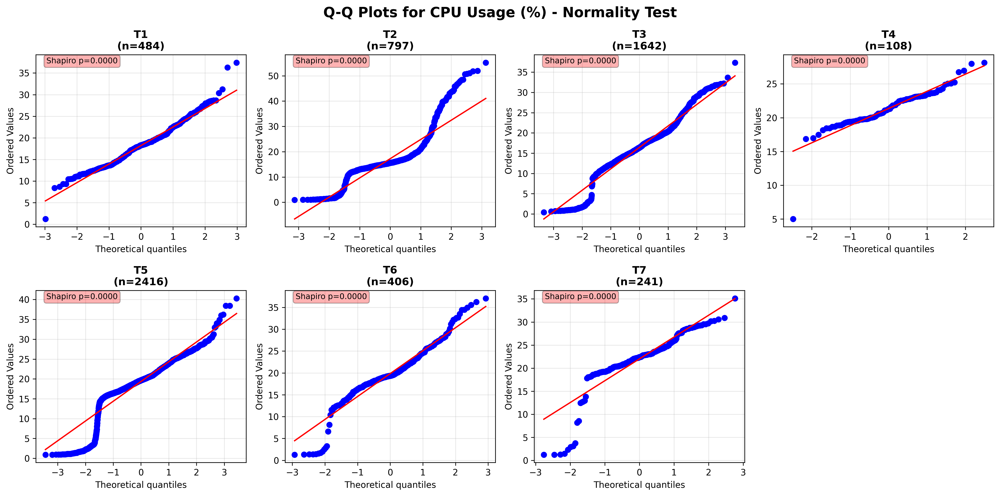

# **Proyecto: Análisis de Desempeño de un  un Servidor de Minecraft**

## Integrantes

- Anderson Vargas
- Esteban Isaac Baires Cerdas.

## Indice

- [Variables de respuesta finales](#variables-de-respuesta-finales)
- [Factores estudiados](#factores-estudiados)
- [Cambios en los tratamientos](#cambios-en-los-tratamientos)
- [Bitácora de Tratamientos Experimentales](#bitácora-de-tratamientos-experimentales)
- [Análisis de los Datos Obtenidos](#análisis-de-los-datos-obtenidos)
  - [Análisis y Descripción de los Datos](#análisis-y-descripción-de-los-datos)
  - [Verificación de Supuestos: Normalidad](#verificación-de-supuestos-normalidad)
  - [Análisis de Varianza entre Tratamientos](#análisis-de-varianza-entre-tratamientos)
  - [Análisis Post-Hoc](#análisis-post-hoc)
- [Conclusiones y Recomendaciones](#conclusiones-y-recomendaciones)


## Etapa 3:  Presentación de los resultados obtenidos

En este proyecto se evaluo el rendimiento de un servidor de Minecraft bajo distintas configuraciones, con el objetivo de encontrar la mejor combinación de parámetros que ofrezcan una mayor estabilidad, eficiencia en el uso de recursos y mejor experiencia de usuario.

---

### Variables de respuesta finales

* **TPS (Ticks Per Second):** Indica la velocidad de simulación del juego en el servidor, su variación afecta globalmente a los jugadores conectados. El ideal es 20 TPS.

* **Uso de CPU:** Cantidad de CPU utilizada por el proceso del servidor en un momento dado.

* **Uso de RAM:** Memoria RAM consumida por el servidor en un momento dado.

* ~~**Latencia promedio:**	Tiempo medio de respuesta del servidor a los jugadores, su variación afecta individualmente a cada jugador.~~

> **Nota:** La latencia promedio no se considerará en el análisis final debido a la pérdida de datos críticos en la base de datos.

* ~~**Tiempo de inicio del servidor:**	Tiempo que tarda el servidor en arrancar desde que se ejecuta hasta cargar el mundo y permitir el ingreso de jugadores.~~

> **Nota:** El tiempo de inicio del servidor no se condiseró debido a la variabilidad en el tamaño del mundo y la complejidad de las estructuras generadas, lo que introduce una fuente significativa de variabilidad no controlada.

### Factores estudiados.

* **Mods de Optimización:**
  Los mods de optimización en Fabric ayudan a mejorar la administración de memoria, la eficiencia en cálculos y la carga de chunks.

    * M1 sin mods (Base de comparación).

    * M3 con estos mods de optimización :
    
      - [Lithium](https://modrinth.com/mod/lithium/versions) - Un mod diseñado para mejorar drásticamente el rendimiento general de Minecraft sin romper el comportamiento vanilla del juego.
      - [C2ME](https://modrinth.com/mod/c2me-fabric/versions) - Un mod diseñado para mejorar el rendimiento de la generación de chunks, E / S, y la carga. Esto se hace aprovechando múltiples núcleos de CPU en paralelo.
      - [VMP](https://modrinth.com/mod/vmp-fabric) - Un mod diseñado para mejorar el rendimiento general del servidor con un alto número de jugadores.
      - [FerriteCore](https://modrinth.com/mod/ferrite-core/versions) - Un mod que reduce el uso de memoria de Minecraft de diferentes maneras.

      - [Noisium](https://modrinth.com/mod/noisium) - Mod que optimiza el rendimiento de la generación de mundos. Afirma obtner mejoras que se sitúan entre un 20-30% de aceleración al generar nuevos chunks.
      - [Krypton](https://modrinth.com/mod/krypton/versions) - Un mod que optimiza la pila de red de Minecraft y el rastreador de entidades.
      - [Async](https://modrinth.com/mod/async) - Async es un mod de Fabric diseñado para mejorar el rendimiento de las entidades procesándolas en hilos paralelos.
      - [ServerCore](https://modrinth.com/mod/servercore) - Muchas de las optimizaciones de este mod se centran en deshacerse de la mayoría de los lagspikes aleatorios en los servidores.


* **Parámetros de la JVM:** Los parámetros de la JVM se utilizan para configurar la Máquina Virtual Java (JVM), que se encarga de ejecutar el bytecode de Java. Al configurar adecuadamente los parámetros de la JVM, podemos mejorar el rendimiento de las aplicaciones Java:

  * Reducir la fragmentación del almacenamiento dinámico
  * Mejorar el rendimiento de las aplicaciones Java
  * Establecer el tamaño de las agrupaciones de memoria
  * Supervisar las estadísticas de recogida de basura
  * Personalizar los valores de la agrupación generacional
  * Detectar fugas de memoria

  Los parámetros a usar se dividiran en los conjuntos P1, P2 Y P3:

  * P1: Conjunto básico de argumentos generados por Crafty Controller para ejecutar el servidor:
 `java -Xms1000M -Xmx14336M -jar fabric-1.21.4.jar nogui`

  * P3: Conjunto de parámetros generados por herramientas en línea como [flags.sh](https://flags.sh):

  ```sh
  java -Xms14336M -Xmx14336M --add-modules=jdk.incubator.vector -XX:+UseG1GC -XX:+ParallelRefProcEnabled -XX:MaxGCPauseMillis=200 -XX:+UnlockExperimentalVMOptions -XX:+DisableExplicitGC -XX:+AlwaysPreTouch -XX:G1HeapWastePercent=5 -XX:G1MixedGCCountTarget=4 -XX:InitiatingHeapOccupancyPercent=15 -XX:G1MixedGCLiveThresholdPercent=90 -XX:G1RSetUpdatingPauseTimePercent=5 -XX:SurvivorRatio=32 -XX:+PerfDisableSharedMem -XX:MaxTenuringThreshold=1 -Dusing.aikars.flags=https://mcflags.emc.gs -Daikars.new.flags=true -XX:G1NewSizePercent=40 -XX:G1MaxNewSizePercent=50 -XX:G1HeapRegionSize=16M -XX:G1ReservePercent=15 -jar fabric-1.21.4.jar --nogui
  ```

- **Configuración del Servidor:**
El rendimiento del servidor también se ve afectado por la distancia de renderizado y la simulación de entidades.

  - C1: Render 10, Simulación 6 (Valores estándar).

  - C2: Render 6, Simulación 4 (Configuración más ligera).

  - C3: Render 14, Simulación 8 (Carga más alta para evaluar impacto).

---

### Cambios en los tratamientos

Tratamientos anteriores

| **Tratamiento** | **Mods** | **JVM** | **Configuración del Servidor** | **Hipótesis** |
|---------------|------------------------------|------|----------------------|----------------|
| **T1** | M1 | P1 | C1 | Establece la línea base de rendimiento sin optimizaciones. Se espera el desempeño más bajo en eficiencia de recursos y estabilidad. |
| **T2** | M1 | P2 | C1 | El uso de parámetros JVM manualmente seleccionados mejorará el desempeño en comparación con la configuración base (T1). |
| **T3** | M1 | P3 | C1 | Se espera que los parámetros generados automáticamente mejoren el rendimiento más que los parámetros manuales (T2) y la configuración base (T1). |
| **T4** | M2 | P1 | C1 | La adición de un pequeño conjunto de mods de optimización mejorará la eficiencia del servidor frente a (T1) y (T2). |
| **T5** | M3 | P1 | C1 | Un conjunto más amplio de mods de optimización debería mejorar aún más el rendimiento frente a (T4) y (T1). |
| **T6** | M2 | P2 | C1 | La adición de un pequeño conjunto de mods de optimización y los parámetros JVM seleccionados reducirán el uso de recursos, especialmente en comparación con (T1) y a menor grado con (T2) y (T4)|
| **T7** | M3 | P3 | C1 | La combinación de muchos mods y parámetros automáticos representa la segunda mayor intervención y se espera que logre el mejor rendimiento general frente a todos los tratamientos anteriores. |
| **T8** | M3 | P3 | C2 | La combinación de muchos mods, parámetros automáticos y configuración ligera representa la mayor intervención y se espera que logre el mejor rendimiento general frente a todos los tratamientos. |
| **T9** | M3 | P3 | C3 | Se busca determinar si las máximas optimizaciones resisten una configuración exigente, manteniendo estabilidad bajo alta carga. |

**Nuevos tratamientos:**

| **Tratamiento** | **Mods** | **JVM** | **Configuración del Servidor** | **Hipótesis** |
|---------------|------------------------------|------|----------------------|----------------|
| **T1** | M1 | P1 | C1 | Establece la línea base de rendimiento sin optimizaciones. Se espera el desempeño más bajo en eficiencia de recursos y estabilidad. |
| **T2** | M1 | P1 | C3 | Se espera que una configuración más pesada sin optimización genere un mayor impacto (negativo) sobre las variables de respuesta que (T8) |
| **T3** | M1 | P3 | C1 | Se espera que los parámetros generados automáticamente mejoren el rendimiento más que la configuración base (T1). |
| **T4** | M3 | P1 | C1 | Un conjunto más amplio de mods de optimización debería mejorar aún más el rendimiento frente a (T4). |
| **T5** | M3 | P3 | C1 | La combinación de muchos mods y parámetros automáticos representa la segunda mayor intervención y se espera que logre el mejor rendimiento general frente a todos los tratamientos anteriores. |
| **T6** | M3 | P3 | C2 |nLa combinación de muchos mods, parámetros automáticos y configuración ligera representa la mayor intervención y se espera que logre el mejor rendimiento general frente a todos los tratamientos. |
| **T7** | M3 | P3 | C3 | Se busca determinar si las máximas optimizaciones resisten una configuración exigente, manteniendo estabilidad bajo alta carga. |

### Bitácora de Tratamientos Experimentales

| Fecha | Tratamiento | Hora Inicio | Hora Fin | Duración/Estado | Observaciones |
|-------|-------------|-------------|----------|-----------------|---------------|
| 11/5  | Ninguno     | -           | -        | -               | Sin tratamiento |
| 11/6  | T1          | 18:00       | 12/6 06:00 | 12 horas      | - |
| 12/6  | T7          | 09:00       | 12/6 23:00 | ~14 horas     | **Eliminado por mod sin cargar** |
| 12/6  | T3          | 23:00       | 14/6 16:00 | ~41 horas     | - |
| 14/6  | T5          | 16:00       | 19/6 10:00 | ~114 horas    | - |
| 19/6  | T4          | 11:00       | -          | -               | **Tratamiento eliminado** |
| 20/6  | T7          | 18:09:10    | 20/6 20:59 | 2h 49min      | - |
| 20/6  | T6          | 21:09:05    | 21/6 15:00 | ~18 horas     | Done (82.732s) |
| 21/6  | T5          | 15:00       | 21/6 18:00 | 3 horas       | Done (59.171s) |
| 21/6  | T4          | 18:00       | 22:00      | 4 horas       | Done (25.903s) |
| 21/6  | T3          | 22:20       | 22/6 12:00 | ~13h 40min    | Done (10.304s) |
| 22/6  | T6          | 15:02       | 22/6 18:00 | ~18 horas     | Done (82.732s) |
| 22/6  | T7          | 18:00       | 22/6 21:00 | 3 horas       | Done (98.652s) |
| 22/6  | T2          | 21:02       | 28/6 16:10 | ~138 horas    | Done (8.705s) |
| 28/6  | T6          | 16:10:11    | 4/7  00:00 | ~128 horas    | |
| 4/7   | T4          | 01:00:00    | -          | -               | En progreso |

> **Nota:** Algunos tratamientos cuentan con un tiempo de ejecución significativamente mayor al resto, lo que puede influir en la estabilidad de las variables de respuesta. Por ejemplo, T2 se ejecutó durante 138 horas, mientras que T1 solo 12 horas. Esto puede generar una variabilidad no controlada en los resultados.

## Análisis de los Datos Obtenidos

### Análisis y Descripción de los Datos

Para cada tratamiento experimental se midieron tres variables críticas de desempeño del servidor de Minecraft: TPS (Ticks Per Second), uso de CPU (%) y uso de RAM (MB). La siguiente tabla resume los valores mínimo, máximo y promedio de cada variable para los siete tratamientos evaluados.

| Tratamiento | TPS Min | TPS Max | TPS Mean | CPU Min | CPU Max | CPU Mean | RAM Min | RAM Max | RAM Mean |
|-------------|---------|---------|----------|---------|---------|----------|---------|---------|----------|
| T1 | 19.47 | 20.0 | 19.94 | 1.24 | 37.41 | 18.22 | 711 | 2640 | 1961 |
| T2 | 6.35 | 20.0 | 19.87 | 0.98 | 55.22 | 17.24 | 1032 | 4634 | 2040 |
| T3 | 15.63 | 20.0 | 19.87 | 0.4 | 37.35 | 16.42 | 744 | 8993 | 4825 |
| T4 | 19.49 | 20.0 | 19.87 | 5.01 | 28.15 | 21.36 | 2543 | 3094 | 2839 |
| T5 | 14.3 | 20.0 | 19.72 | 0.9 | 40.3 | 19.34 | 1153 | 10713 | 5875 |
| T6 | 16.34 | 20.0 | 19.83 | 1.29 | 37.07 | 19.85 | 2553 | 7955 | 5335 |
| T7 | 15.89 | 20.0 | 19.81 | 1.24 | 35.12 | 22.0 | 3237 | 8114 | 6077 |

### Observaciones Preliminares por Variable

**TPS (Ticks Per Second):**

- Los valores óptimos de TPS para servidores de Minecraft se sitúan en 20, representando un funcionamiento fluido del juego
- Seis de los siete tratamientos mantienen promedios cercanos al óptimo (19.87-19.94), sugiriendo configuraciones generalmente estables
- T2 presenta la anomalía más significativa con un valor mínimo de 6.35 TPS, indicando episodios críticos de degradación del rendimiento

**CPU Usage (%):**

- El uso del CPU varía considerablemente entre tratamientos (16.42% - 22.0% promedio)
- T2 y T3 emergen como las configuraciones más eficientes, mientras que T4 y T7 demandan mayor procesamiento

**RAM Usage (MB):**

- Esta métrica exhibe la mayor variabilidad entre tratamientos, con promedios que oscilan desde 1961 MB hasta 6077 MB
- Se identifica una diferenciación clara: configuraciones de bajo consumo (T1, T2, T4) versus configuraciones intensivas en memoria (T3, T5, T6, T7)
- T5 representa el escenario más demandante con un consumo promedio 3.1 veces superior al más eficiente

### Análisis de los Gráficos de Cajas y Bigotes

Los boxplots elaborados proporcionan una perspectiva visual integral de la distribución, variabilidad y comportamiento atípico de cada métrica de rendimiento, complementando el análisis descriptivo anterior.

**TPS (Ticks Per Second):**


**Hallazgos principales:**

- **Estabilidad superior:** T1 y T4 exhiben las distribuciones más compactas, con rangos intercuartílicos estrechos que indican rendimiento predecible y consistente
- **Variabilidad crítica:** T2 muestra la mayor dispersión con valores atípicos extremos hacia el rango inferior, confirmando episodios de degradación severa del rendimiento

**CPU Usage (%):**


**Hallazgos principales:**

- **Eficiencia contrastante:** Los boxplots revelan una clara diferenciación entre tratamientos eficientes (T4, T7) con medianas bajas y distribuciones compactas, versus configuraciones intensivas (T2, T5)
- **Patrones de carga:** T2 muestra valores atípicos en el extremo superior, indicando picos ocasionales de alta demanda computacional a pesar de su eficiencia promedio
- **Estabilidad operacional:** T4 presenta una distribución más concentrada en el rango medio, sugiriendo un consumo consistentemente elevado pero predecible, T7 se comporta de manera similar, pero con mayor variabilidad y minimos más bajos.

T3 presenta la menor media de uso de CPU, pero con una distribución más amplia, lo que indica que aunque en promedio es eficiente, puede experimentar picos de carga significativos. Además como se verá más adelante, T3 es el tratamiento con una de las medias más altas de uso de RAM, lo que sugiere que la eficiencia en CPU no siempre se traduce en un uso eficiente de memoria.

**RAM Usage (MB):**


**Hallazgos principales:**

- **Segmentación clara:** Los boxplots confirman la existencia de dos grupos distintos de tratamientos con patrones de consumo de memoria fundamentalmente diferentes
- **Grupo eficiente:** T1, T2 y T4 forman un cluster de bajo consumo con distribuciones compactas y medianas similares (≤3300 MB)
- **Grupo intensivo:** T3, T5, T6 y T7 constituyen el grupo de alto consumo, con T2 y T5 mostrando la mayor variabilidad y valores atípicos extremos

Como recordatorio, los tratamientos T3, T5, T6 y T7 alteraban los parámetros de la JVM, mientras que T1, T2 y T4 se centraban en configuraciones más básicas o mods de optimización.

---

### Verificación de Supuestos: Normalidad

Tras el análisis descriptivo y visual, es fundamental verificar los supuestos estadísticos para aplicar pruebas de comparación entre tratamientos. En particular, el análisis de varianza (ANOVA) requiere que los datos de cada grupo sigan una distribución normal.

Para ello, se realizó un análisis de la normalidad para cada variable de respuesta (TPS, uso de CPU y uso de RAM) en cada tratamiento, utilizando el test de Shapiro-Wilk y gráficos Q-Q.

**Test de Shapiro-Wilk:**  
Se aplicó el test de Shapiro-Wilk a los datos de cada tratamiento y métrica. En todos los casos, los p-valores obtenidos fueron menores a 0.05, lo que indica que las distribuciones no son normales.

**Gráficos Q-Q:**  
Se elaboraron gráficos Q-Q para cada combinación de tratamiento y métrica, observándose desviaciones sistemáticas respecto a la línea de normalidad, lo que respalda los resultados del test de Shapiro-Wilk.





**Resultados de la prueba de normalidad**

La mayoría de las distribuciones por tratamiento no cumplen con el supuesto de normalidad (p-valor < 0.05 en casi todos los casos).

Aunque una sola distribución correspondiente a la variable de respuesta RAM obtuvo un p-valor de 0.08 (mayor a 0.05), esto no constituye evidencia suficiente para asumir normalidad, sino simplemente que no se puede rechazar la hipótesis nula de normalidad en ese caso específico.

En contraste, todas las demás distribuciones (incluyendo las de TPS y CPU) no presentan normalidad.

Por tanto, NO es adecuado utilizar un análisis de varianza paramétrico (ANOVA), ya que este requiere que todas las distribuciones cumplan con el supuesto de normalidad y homogeneidad de varianzas.

**Resumen de resultados del test de normalidad**

- TPS: 0/7 tratamientos con normalidad

- CPU: 0/7 tratamientos con normalidad

- RAM: 1/7 tratamientos con p > 0.05 (p = 0.08), el resto no presenta normalidad

---

### Análisis de Varianza entre Tratamientos

Dado que no se cumplen los supuestos necesarios para aplicar pruebas paramétricas, **se emplea el método no paramétrico de Kruskal-Wallis** para comparar los tratamientos en cada variable de respuesta (TPS, CPU y RAM). Esta prueba permite determinar si existen diferencias significativas entre las distribuciones de los tratamientos, sin requerir normalidad en los datos.

Parámetros del test de Kruskal-Wallis:

- **H (estadístico de Kruskal-Wallis):** Mide la diferencia global en los rangos entre los grupos.
- **Valor-p (p):** Probabilidad de obtener un resultado igual o más extremo si no hay diferencias reales.
- **η² (eta cuadrado):** Tamaño del efecto (proporción de la variabilidad explicada por el tratamiento).
- **n:** Tamaño de muestra por grupo.

#### **Resultados del test de Kruskal-Wallis:**

- **TPS (Ticks Per Second):**  
  - H = 448.61, p < 0.0001, η² = 0.072 (grande)
  - Resultado: Se rechaza la hipótesis nula. Existen diferencias significativas entre tratamientos.

- **CPU Usage (%):**  
  - H = 554.87, p < 0.0001, η² = 0.158 (grande)
  - Resultado: Se rechaza la hipótesis nula. Existen diferencias significativas entre tratamientos.

- **RAM Usage (MB):**  
  - H = 3681.77, p < 0.0001, η² = 0.55 (muy grande)
  - Resultado: Se rechaza la hipótesis nula. Existen diferencias significativas entre tratamientos.


En todos los casos, el valor-p fue menor a 0.05, por lo que se concluye que **al menos uno de los tratamientos difiere significativamente de los demás** en cada métrica analizada.  
El tamaño del efecto (η²) muestra que las diferencias detectadas son de magnitud mediana a muy grande, especialmente en el uso de RAM.

#### Análisis Post-Hoc

Después de identificar diferencias globales significativas con la prueba de Kruskal-Wallis, se llevó a cabo un análisis post-hoc entre pares de tratamientos para determinar específicamente dónde se encuentran las diferencias.

**Metodología:**

- Para cada variable significativa, se realizaron comparaciones pareadas entre todos los tratamientos usando la prueba de Mann-Whitney U (equivalente a la prueba de Dunn).
- Se aplicó la **corrección de Bonferroni** para controlar el error por comparaciones múltiples. Al realizar múltiples pruebas U de Mann-Whitney, la probabilidad de encontrar un resultado significativo por casualidad (error tipo I) aumenta. La corrección de Bonferroni ayuda a reducir esta probabilidad ajustando el valor p de cada prueba. En lugar de usar un valor alfa predefinido (por ejemplo, 0.05), la corrección divide este valor alfa por el número de pruebas realizadas.
- Para cada comparación se reportan:
  - **p (Bonferroni):** Valor-p ajustado. Si es menor a 0.05, la diferencia es significativa.
  - **r (tamaño del efecto):** Magnitud de la diferencia observada. Interpretación: r < 0.1 (negligible), < 0.3 (pequeño), < 0.5 (mediano), ≥ 0.5 (grande).
  - **Medianas:** Valores centrales de cada grupo, para interpretación práctica.

---

**Resultados principales para cada métrica (apoyados con matrices visuales):**

---

**TPS (Ticks Per Second):**

Matriz de comparaciones post-hoc para TPS:


- T1 presenta diferencias significativas frente a T4 (p=0.0000, r=0.359, efecto grande), T5 (p=0.0000, r=0.227, efecto pequeño-moderado), T6 (p=0.0000, r=0.124, efecto pequeño) y T7 (p=0.0038, r=0.256, efecto moderado).
- T2 muestra un patrón similar con diferencias significativas frente a T4 (p=0.0000, r=0.317, efecto grande), T5 (p=0.0000, r=0.295, efecto moderado), T6 (p=0.0000, r=0.164, efecto pequeño) y T7 (p=0.0000, r=0.267, efecto moderado).
- T3 (solo optimización JVM) muestra diferencias significativas únicamente frente a T5 (p=0.0000, r=0.208, efecto pequeño) y T7 (p=0.0002, r=0.102, efecto pequeño).

Entre los tratamientos optimizados, solo T4 vs T5 muestra diferencia significativa (p=0.0007, r=0.006, efecto muy pequeño), indicando que aunque existen diferencias estadísticas, la variación real en TPS es mínima (0.15 TPS de diferencia entre las medias más alta y más baja).

**CPU Usage (%):**

Matriz de comparaciones post-hoc para CPU:


- Los tratamientos muestran diferencias significativas en la mayoría de comparaciones, con solo 3 comparaciones no significativas: T2 vs T3 (p=1.0000), T4 vs T7 (p=0.0793), y T5 vs T6 (p=1.0000).
- Las diferencias más pronunciadas se observan entre tratamientos de bajo consumo (T1, T2, T3) y alto consumo (T4, T7):

- T1 vs T7 (p=0.0000, r=0.456, efecto grande): diferencia de ~4 puntos porcentuales en las medias (18.22% vs 22.0%)
- T2 vs T7 (p=0.0000, r=0.449, efecto grande): diferencia de ~5 puntos porcentuales (17.24% vs 22.0%)
- T3 vs T7 (p=0.0000, r=0.387, efecto moderado): diferencia de ~6 puntos porcentuales (16.42% vs 22.0%)

---

**RAM Usage (MB):**

Matriz de comparaciones post-hoc para RAM:


- Prácticamente todas las comparaciones son significativas (solo T5 vs T7 con p=0.8214), mostrando diferencias sustanciales entre todos los tratamientos.
- Las diferencias más notables se dan entre tratamientos de bajo consumo (T1, T2) y alto consumo (T5, T6, T7), con tamaños del efecto muy grandes:
    - T1 vs T7 (p=0.0000, r=0.815, efecto muy grande): diferencia de ~4116 MB en las medias (1961 MB vs 6077 MB)
    - T1 vs T6 (p=0.0000, r=0.862, efecto muy grande): diferencia de ~3374 MB (1961 MB vs 5335 MB)
    - T2 vs T6 (p=0.0000, r=0.804, efecto muy grande): diferencia de ~3295 MB (2040 MB vs 5335 MB)
    - T2 vs T3 (p=0.0000, r=0.740, efecto grande): diferencia de ~2785 MB (2040 MB vs 4825 MB)

---

### Interpretación de Resultados

#### TPS (Ticks Per Second)

Los análisis post-hoc revelan que, aunque la prueba de Kruskal-Wallis **detectó diferencias significativas** entre tratamientos, el **impacto práctico es mínimo**. T1 y T2 (configuraciones básicas) muestran diferencias significativas frente a la mayoría de tratamientos optimizados (T4-T7), pero los tamaños del efecto son predominantemente pequeños a moderados (r = 0.124-0.359). La diferencia real en TPS entre las medias más alta y más baja es apenas **0.22 ticks**, lo que en términos prácticos resulta imperceptible para la experiencia de juego.

**Principal hallazgo:**: T2 presenta valores mínimos extremos (6.35 TPS), indicando que una configuración exigente sin optimizaciones puede generar episodios críticos de degradación del rendimiento, confirmando la necesidad de optimizaciones bajo cargas altas.

#### Uso de CPU

El análisis post-hoc confirma diferencias sustanciales en eficiencia de procesamiento. Los tratamientos se agrupan claramente: T2 y T3 demuestran mayor eficiencia (16.42-17.24% de uso promedio), mientras que T4 y T7 requieren significativamente más procesamiento (21.36-22.0%). Los tamaños del efecto más grandes se observan entre configuraciones básicas y T7 (r = 0.387-0.456, efectos grandes), con diferencias de hasta 6 puntos porcentuales.

**Principal hallazgo:** T3 (solo optimización JVM) logra el menor uso de CPU (16.42%), sugiriendo que las optimizaciones JVM son más eficientes que los mods de optimización para el procesamiento.

#### Uso de RAM

Esta es la métrica con diferencias más dramáticas y prácticamente universales (solo 1 comparación no significativa). Los tratamientos se estratifican claramente en **dos grupos**: bajo consumo (T1, T2: ~2000 MB) y alto consumo (T3, T5-T7: 4825-6077 MB).

Los tamaños del efecto son consistentemente muy grandes (r > 0.7), con diferencias que superan los 4000 MB entre extremos.

**Principal hallazgo:** Las optimizaciones más complejas (especialmente con múltiples mods) requieren sustancialmente más memoria, lo que podría limitar la escalabilidad del servidor.

---

### Limitaciones del Estudio y Factores No Controlados

#### Variables de Confusión Identificadas

**Variabilidad en la Carga de Jugadores:**

- La cantidad de jugadores activos por tratamiento no fue estandarizada completamente, lo que introduce una fuente significativa de variabilidad no controlada
- Esta variabilidad puede explicar parcialmente los valores atípicos observados en TPS y CPU, especialmente en tratamientos como T2 que mostraron episodios de degradación severa

Para controlar este factor, se agrego una función en la [extracción de datos](/src/extract_response_vars_iterations.py) donde se limpian los registros obtenidos cuando un jugador no ha estado conectado durante más de una cantiad de minutos selecta (1 minuto en este caso).

**Efectos de Inactividad y Bloqueo Experimental:**

- Los períodos de inactividad del servidor afectaron la continuidad de las mediciones, requiriendo implementar estrategias de bloqueo temporal
- Los reiniciarios y pausas del servidor pueden haber influido en los patrones de uso de memoria, especialmente en el comportamiento del garbage collector de Java

**Heterogeneidad del Entorno de Ejecución:**

**Tamaño y Complejidad del Mundo:**

- El tamaño del mundo de Minecraft y la complejidad de las estructuras generadas impactan directamente en el tiempo de inicio del servidor y el consumo base de memoria
- Mundos con mayor número de chunks cargados, estructuras complejas, y entidades activas demandan significativamente más recursos
- Esta variable no fue estandarizada entre tratamientos, introduciendo variabilidad no atribuible a las configuraciones evaluadas

**Pérdida de Datos Críticos:**

- La eliminación de datos de latencia de la base de datos representó una pérdida significativa de información sobre el rendimiento de red
- La latencia es un indicador crucial de la experiencia del usuario y puede estar correlacionada con las métricas analizadas
- Esta pérdida limitó la capacidad de realizar un análisis multivariado completo del rendimiento del servidor

---

### Conclusiones y Recomendaciones

#### Hallazgos Principales

**Rendimiento General del Servidor:**

- **Estabilidad robusta en TPS:** Los análisis post-hoc revelan que, aunque estadísticamente significativas, las diferencias en TPS tienen impacto práctico mínimo entre tratamientos (diferencia máxima de 0.22 TPS entre medias). Todos los tratamientos mantienen rendimiento cercano al óptimo (19.72-19.94 TPS promedio).
- **Excepción crítica:** T2 presenta vulnerabilidad con valores mínimos de TPS extremadamente bajos (6.35), sugiriendo que configuraciones sin optimización pueden experimentar colapsos temporales bajo carga elevada
- **Implicación práctica:** La estabilidad en TPS no es el factor diferenciador principal entre configuraciones optimizadas, pero las optimizaciones son esenciales para prevenir colapsos críticos.

**Eficiencia Computacional (CPU):**

- **Incógnita de optimización::** Contraintuitivamente, T3 (solo JVM optimizado, 16.42% promedio) demuestra mayor eficiencia que configuraciones con múltiples mods de optimización como T4 y T7 (21.36-22.0% promedio).
- **Intercambio identificado:** Los mods de optimización, aunque mejoran estabilidad, incrementan la carga computacional, sugiriendo que las optimizaciones JVM son más eficientes energéticamente.
- **Implicación práctica:** Para entornos con recursos limitados de CPU, priorizar configuraciones base optimizadas (T1, T3) sobre configuraciones con múltiples mods.

**Gestión de Memoria (RAM):**

- **Factor más diferenciador:** El consumo de RAM presenta las diferencias más dramáticas entre tratamientos.
- **Dudas sobre escalabilidad:** Las diferencias superiores a 4000 MB entre extremos representan implicaciones serias sobre costos operativos y escalabilidad del servidor.

#### **Recomendaciones Estratégicas**

**Para Entornos de Producción de Alta Demanda:**

T6 como configuración óptima: Ofrece el mejor equilibrio entre estabilidad garantizada, uso moderado de CPU (19.85%) y consumo de RAM controlado (5335 MB) comparado con otras configuraciones complejas.
Implementar monitoreo continuo de RAM como métrica crítica de escalabilidad.

**Para Entornos con Recursos Limitados:**

T3 como solución eficiente: Maximiza la eficiencia de CPU mientras mantiene estabilidad, ideal para servidores con restricciones de procesamiento.
Considerar T1 si las limitaciones de memoria son extremas, con monitoreo proactivo para prevenir degradación.

**Para Configuraciones de Máximo Rendimiento:**

T5 o T7 para entornos que priorizan estabilidad absoluta sobre eficiencia de recursos, con presupuesto suficiente para infraestructura robusta.

**Evitar por Completo:**

T2 en entornos de producción debido a su vulnerabilidad a colapsos críticos de rendimiento, a pesar de su eficiencia aparente en condiciones normales.
